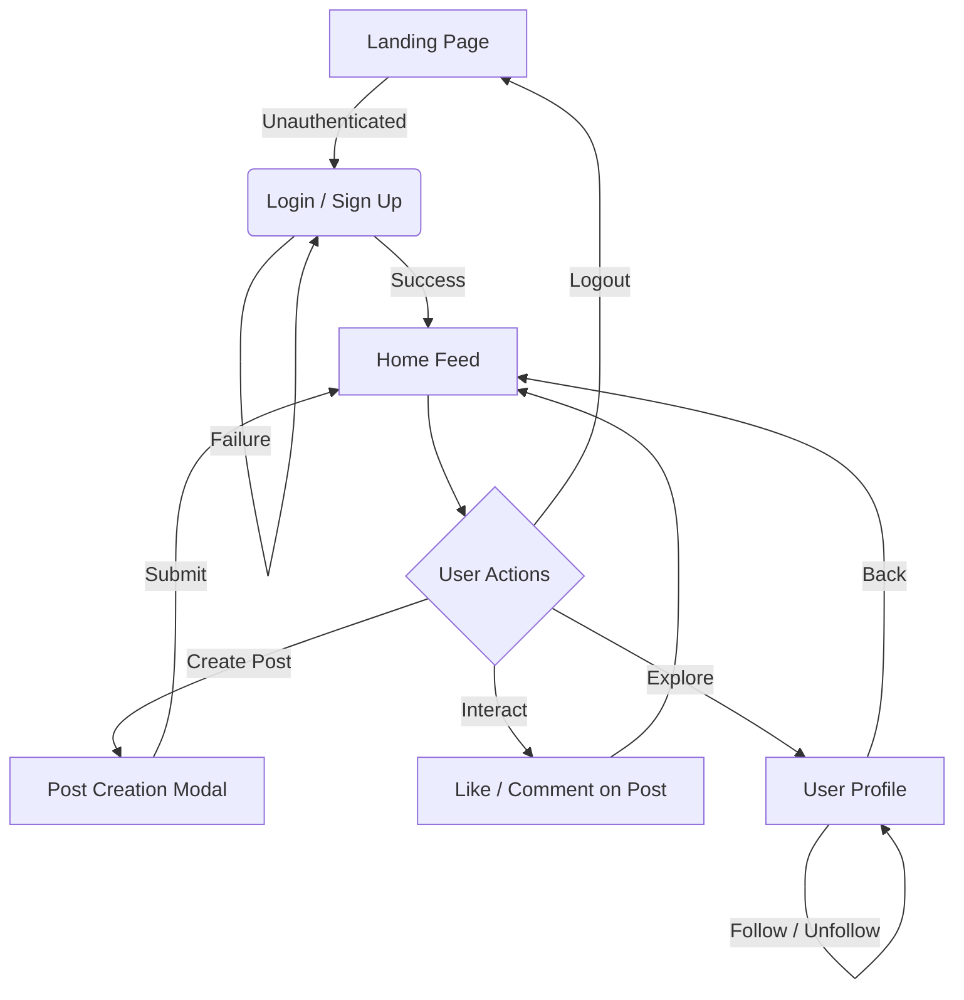
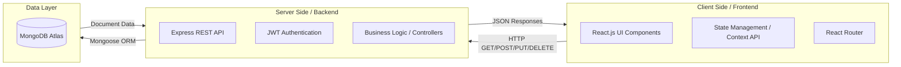
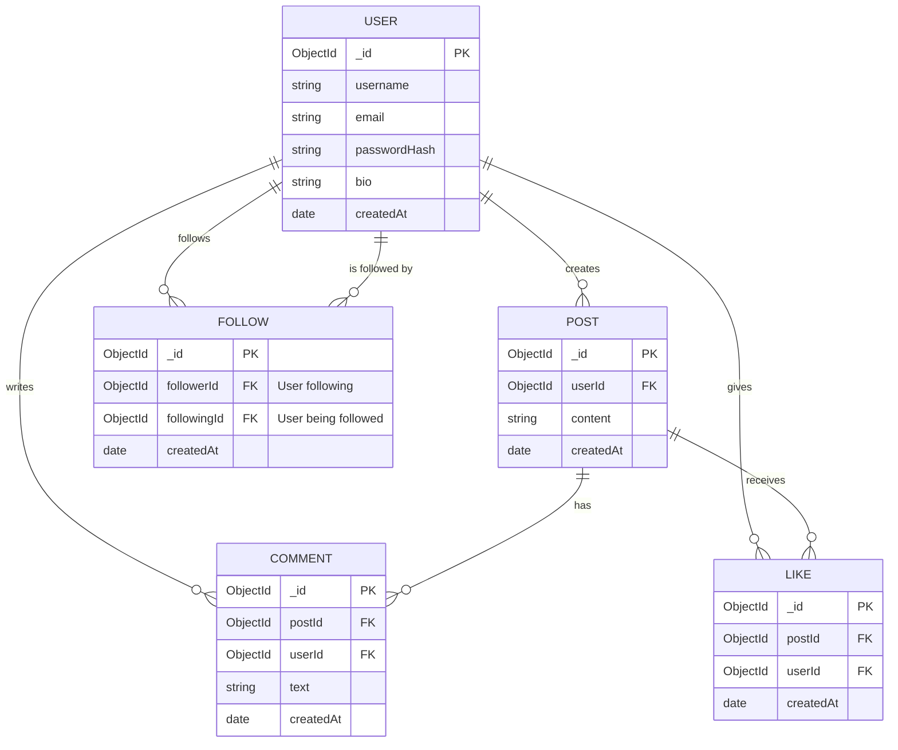

# Week 1 Task: Project Planning & System Architecture

**Project Name:** Nexus (Social Media Platform)
**Author:** Sarthak Srivastava

---

## 1. Project Brief

### Application Purpose
**Nexus** is a modern, minimalist full-stack social media web application designed to foster connection and expression. The platform allows users to share short text-based thoughts, interact with others through likes and comments, and curate a personalized feed by following other users. The primary goal is to provide a seamless and highly responsive user experience for social networking.

### Required Functionalities & Key Features
1. **User Authentication & Authorization:** Secure registration, login, and logout using JWT (JSON Web Tokens).
2. **User Profiles:** Personalized user pages displaying the user's details, bio, follower/following counts, and their posts.
3. **Post Creation:** The ability for users to create, view, and delete text-based posts.
4. **Dynamic Feed:** A chronological feed aggregating posts from all the users that the logged-in user follows.
5. **Social Interactions:** Users can "Like" posts and add "Comments" to posts.
6. **Follow System:** Users can follow and unfollow other users to customize their feed.

---

## 2. User Interactions Flowchart

The following diagram illustrates the primary user journey, from registration/login to interacting with the feed and creating posts.

---

## 3. Technical Architecture Diagram

The system follows a standard **Client-Server Architecture** utilizing the **MERN Stack**. 
- **Frontend:** React.js provides a responsive Single Page Application (SPA) experience.
- **Backend:** Node.js and Express.js handle API requests, business logic, and authentication.
- **Database:** MongoDB, a NoSQL database, stores the flexible document-based data.

---

## 4. Database Schema

The database relies on MongoDB collections. The Entity-Relationship diagram below visualizes the relationships between Users, Posts, Comments, and the Follow system.

---

## 5. Detailed Wireframes

To ensure a clean and intuitive user interface, the application is divided into three core views.

### View 1: Login / Registration Page
- **Layout:** Centered card layout on a split-screen background.
- **Elements:**
  - App Logo ("Nexus") and a brief welcome message.
  - Toggle between "Sign In" and "Create Account".
  - Input fields: Username, Email, Password.
  - Call-to-Action (CTA) Button: "Submit" / "Login".
  - Validation error message placeholders.

### View 2: Main Home Feed
- **Layout:** Standard three-column layout (similar to modern social networks).
- **Left Column:** Navigation Sidebar (Home, Profile, Settings, Logout).
- **Center Column (Main Content):**
  - Top: "Create Post" input box with a "Post" button.
  - Below: Scrollable list of Post Components.
  - **Post Component:** Displays User Avatar, Username, Timestamp, Post Content, and an action bar (Like button with count, Comment button with count).
- **Right Column:** "Who to follow" suggestions (List of recommended user profiles with a "Follow" button).

### View 3: User Profile Page
- **Layout:** Two-column layout (Navigation on left, Profile details in center/right).
- **Header:** Profile Picture, Username, Bio, Follower Count, Following Count. 
- **Action Button:** "Edit Profile" (if viewing own profile) or "Follow/Unfollow" (if viewing another user).
- **Content Area:** A tabbed view displaying the user's "Posts" and "Liked Posts".

---

## 6. Rationale for Design Decisions

1. **Choice of MERN Stack (MongoDB, Express, React, Node.js):**
   - **React:** Chosen for its component-based architecture, which makes building reusable UI pieces (like a `Post` or `Comment` component) highly efficient. It provides a snappy, seamless SPA experience which is vital for a social media feed.
   - **Node.js & Express:** Provides a lightweight and highly performant backend for building RESTful APIs. It handles asynchronous operations effectively, which is important for I/O heavy tasks like fetching feeds and handling real-time likes.
   - **MongoDB:** A NoSQL database is ideal for a social media app because the schema can easily evolve. Storing posts, comments, and user profiles as JSON-like documents maps perfectly to how the frontend consumes the data.

2. **Database Design (Normalization vs. Denormalization):**
   - Instead of deeply embedding comments and likes inside a single `Post` document (which could hit MongoDB's 16MB document limit for popular posts), I opted for separate collections (`Comments`, `Likes`) referencing the `Post ID`. This ensures scalability and faster read times when fetching a feed, as we can paginate comments separately from the main post content.
   - The Follow system is also abstracted into its own collection to efficiently query "followers" and "following" lists without bloating the `User` document.

3. **Authentication Mechanism:**
   - **JWT (JSON Web Tokens):** Selected over traditional session cookies for stateless authentication. This makes the REST API scalable, allowing the frontend to easily store the token (in memory or HTTP-only cookies) and send it via the Authorization header on protected routes.
